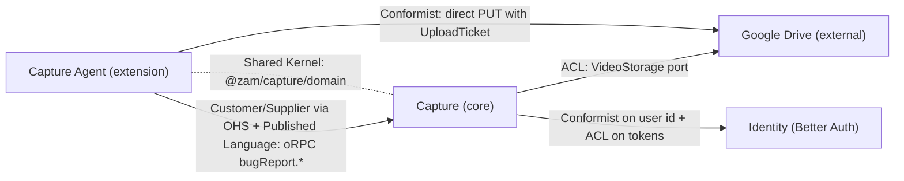
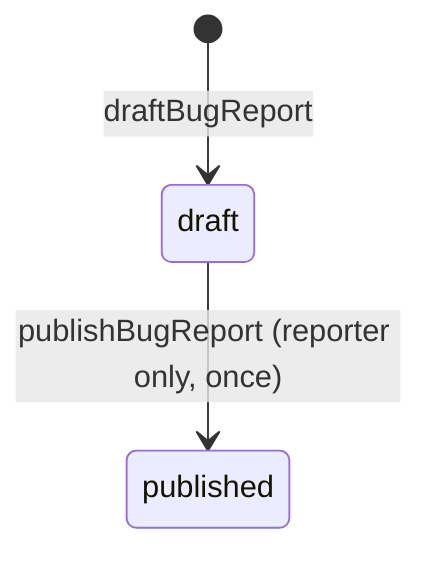
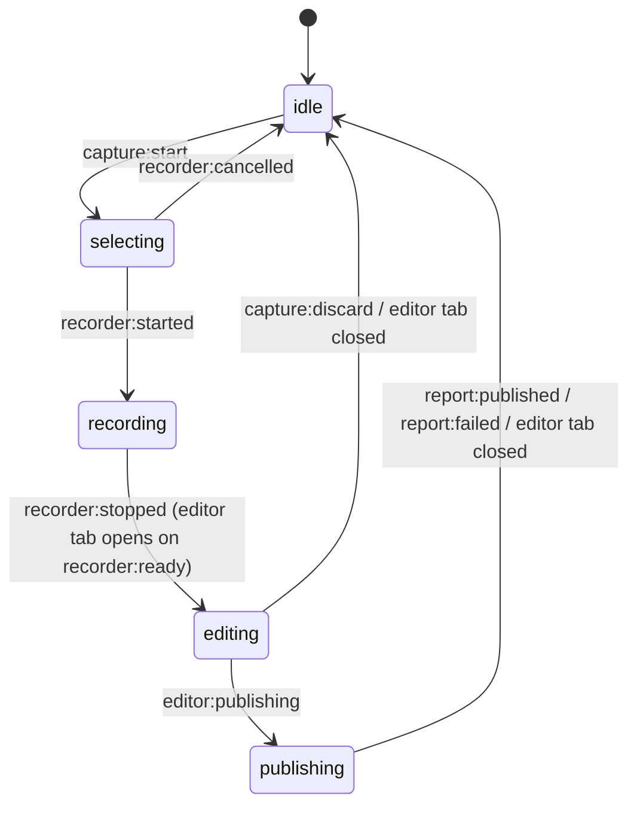
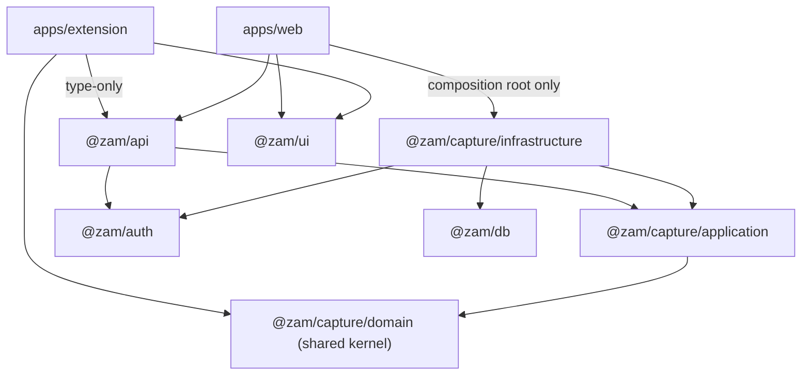
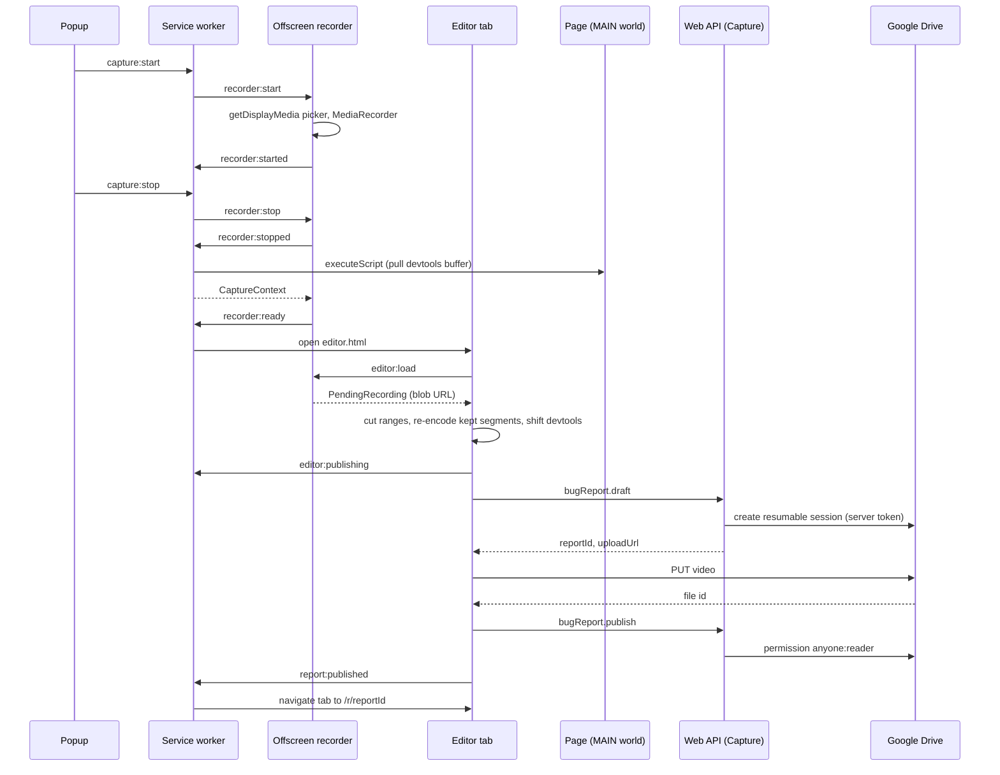

# Zam architecture

Grounded in Jam's product model (jam.dev/docs: "Creating a Jam", "What's in a Jam", "DevTools"): a capture produces a shareable report containing visual evidence plus devtools context (console, network), opened in a new tab after creation.

## §1 Strategic design

Domain vision: someone hits a bug, records it once, and engineers get one link with the video plus the page's console and network context. Videos live in the reporter's own Google Drive; Zam stores report metadata and devtools evidence, never video bytes.

| Subdomain | Type | Why | Bounded context | Home |
| --- | --- | --- | --- | --- |
| Bug capture & reporting | Core | The differentiator: report model, devtools evidence, share link | `Capture` | `packages/capture` |
| Capture agent | Supporting | Required, browser-specific, not differentiating on its own | `Capture Agent` | `apps/extension` |
| Identity & access | Generic | Commodity; bought (Better Auth + Google OAuth) | `Identity` | `packages/auth` |
| Video storage | Generic, external | Google Drive in the user's account | — | Drive REST API |

Ubiquitous language (code names are binding):

| Term | Meaning | Code name |
| --- | --- | --- |
| Capture | Act of recording a screen/window/tab in the extension while collecting devtools context from the active tab | `CaptureSession` (extension) |
| Bug report | Shareable artifact created from one capture; the aggregate | `BugReport` |
| Reporter | Signed-in user who created the report; owns it and its Drive video | `ReporterId` |
| Recording | Metadata of the captured video: mime type, size, duration, start time | `VideoRecording` |
| Stored video | The video file persisted in the reporter's Google Drive | `StoredVideo { fileId }` |
| Devtools snapshot | Console entries + network requests captured during the recording window | `DevtoolsSnapshot` |
| Storage snapshot | Tab's cookies, localStorage, sessionStorage at the moment the recording stopped (top frame only) | `StorageSnapshot { cookies: StoredCookie[], localStorage/sessionStorage: StorageItem[] }` |
| User step | One reporter action during the recording window: click (element descriptor, never typed text), navigation (redacted URL), tab visibility | `UserStep { kind, detail, timestamp }` |
| Client environment | Reporter's browser, OS, viewport/screen, language, time zone, network connection at stop; `null` on older reports | `ClientEnvironment` |
| Console entry | One console call or uncaught error/rejection | `ConsoleEntry` |
| Network request | One fetch/XHR: method, redacted URL, status (0 = failed), duration, request/response headers and bodies (redacted, text-only, capped) | `NetworkRequest` |
| Draft | Report exists, video not yet stored | `status: "draft"` |
| Published | Video stored and link-shared; report complete | `status: "published"` |
| Share link | Public URL `/r/<reportId>`; reportId (UUID v4) is the capability | `ReportId` |
| Upload ticket | One-time Drive resumable-upload URL handed to the extension | `UploadTicket { uploadUrl }` |
| Comment | Markdown note on a bug report by a signed-in user; threads are one level deep (a reply to a reply joins the root's thread) | `Comment` |
| Author | Signed-in user who wrote a comment (any user, not only the reporter) | `AuthorId` |

Context map:

| Relationship | Pattern | Contract | Why |
| --- | --- | --- | --- |
| Capture → Capture Agent | Customer/Supplier; Capture exposes an Open Host Service with a Published Language | oRPC `bugReport.*` Zod schemas in `packages/api/src/routers/bug-report.ts`; extension imports `AppRouterClient` type-only | One team; the agent's needs drive the API. Type-only import = compile-time contract, zero runtime coupling |
| Capture ↔ Capture Agent | Shared Kernel (small, pure) | `@zam/capture/domain/devtools.ts`, `video.ts`, `MAX_TITLE_LENGTH` | Both sides must agree on limits and redaction; kernel has no dependencies and is lint-guarded |
| Identity → Capture | Conformist (identity) + ACL (tokens) | `ReporterId` = Better Auth `user.id` verbatim; tokens only via `GoogleAccessTokens` adapter | Translating ids buys nothing; token refresh/encryption must not leak inward |
| Google Drive → Capture | Anticorruption Layer | `VideoStorage` port; `google-drive-video-storage.ts` maps HTTP statuses to `VideoStorageError` | Drive's model (files, permissions, resumable sessions) never enters the domain |
| Google Drive → Capture Agent | Conformist | Raw resumable `PUT` to `uploadUrl`, read `id` from the response | One call; a wrapper adds nothing |

## §2 Tactical design

| Building block | Element | Notes |
| --- | --- | --- |
| Aggregate root | `BugReport`, `Comment` | Identities `ReportId`, `CommentId`; consistency boundary; one aggregate per transaction. `Comment` references its report and thread root by id |
| Value objects | `ReportId`, `ReporterId`, `VideoRecording`, `StoredVideo`, `DevtoolsSnapshot`, `ConsoleEntry`, `NetworkRequest`, `StorageSnapshot`, `CommentId`, `AuthorId`, `CommentBody` | Immutable, compared by value, validated on creation |
| Factory | `draftBugReport` | The only way to create a report; enforces all invariants |
| Domain policies | `redactUrl`, `redactStorageSnapshot`, `assertValidDevtools`, `parseStorageSnapshot` | Pure functions; no domain service needed (no rule spans aggregates) |
| Repository (write side) | `BugReportRepository { save, findById }`, `CommentRepository { save, findById }` | Domain port; loads/saves the whole aggregate |
| Read model (query side) | `BugReportReadModel { searchSummariesByReporter, findSharedById, findVideoLocation }`, `CommentReadModel { listByReport }` | Application port returning DTOs straight from storage (§5) |
| Data mapper | `bugReportMapper`, `commentMapper` (`infrastructure/drizzle/mappers/`) | `toDomain` / `toPersistence` for repositories, `toSharedRecord` / `toSummary` / `toView` for read models; the only code that knows both a table row and a domain/DTO shape |
| Application services | Commands `draftBugReport`, `publishBugReport`, `postComment`; queries `listMyBugReports`, `viewSharedBugReport`, `listReportComments` | Orchestrate ports; hold no business rules |
| Domain errors | `CaptureDomainError` codes | Translated to transport errors only in the oRPC adapter |
| Domain events | None | §5 |
| Process manager (Capture Agent) | `CaptureSession` state machine in the service worker | Coordinates popup, offscreen recorder, tab, API, Drive |

Style: immutable records + pure functions, not classes (repo lint forbids parameter properties and >1 class per file; records cross extension messaging and oRPC unchanged).

Aggregate `BugReport`:

- `BugReport = DraftBugReport | PublishedBugReport` (discriminated on `status`); `DraftBugReport.video: null`, `PublishedBugReport.video: StoredVideo`. The type system enforces "published ⇔ video present".
- Fields: `id: ReportId`, `reporterId: ReporterId`, `title: string`, `pageUrl: string | null`, `recording: VideoRecording`, `devtools: DevtoolsSnapshot`, `createdAt: Date`, `status`, `video`.
- Invariants enforced in `draftBugReport` (throw `CaptureDomainError("INVALID_BUG_REPORT", <reason>)`):
  1. `title.trim()` length 1..`MAX_TITLE_LENGTH` (200); stored trimmed.
  2. `pageUrl` is `null` or an `http:`/`https:` URL (`URL.canParse`) of length ≤ `MAX_URL_LENGTH` (2048).
  3. `recording.mimeType === VIDEO_MIME_TYPE` (`"video/webm"`); `sizeBytes` integer 1..`MAX_VIDEO_BYTES` (500 MiB = 524_288_000); `durationMs` integer 1..`MAX_RECORDING_DURATION_MS` (300_000); `startedAt` a valid Date.
  4. Devtools (`assertValidDevtools`): ≤ `MAX_LOG_ENTRIES` (1000) console entries and ≤ 1000 network requests; console `level ∈ CONSOLE_LEVELS`, `message.length ≤ MAX_CONSOLE_MESSAGE_LENGTH` (2000); network `method` 1..16 chars, `url.length ≤ 2048`, `status` integer 0..599, `durationMs ≥ 0`; every `timestamp` finite; network headers (if present) ≤ `MAX_NETWORK_HEADER_COUNT` (30) entries with names ≤ `MAX_NETWORK_HEADER_NAME_LENGTH` (100) and values ≤ `MAX_NETWORK_HEADER_VALUE_LENGTH` (500) chars; network bodies (if present) ≤ `MAX_NETWORK_BODY_LENGTH` (2000) chars plus the truncation marker.
- `publishBugReport(report, actorId, video)` rules: `actorId !== report.reporterId` → `BUG_REPORT_ACCESS_DENIED`; `report.status === "published"` → `BUG_REPORT_ALREADY_PUBLISHED`; `video.fileId` empty → `INVALID_BUG_REPORT`. Returns a new `PublishedBugReport`.
- Identity: `toReportId(value)` accepts only UUID strings (top-level regex `/^[0-9a-f]{8}-[0-9a-f]{4}-[0-9a-f]{4}-[0-9a-f]{4}-[0-9a-f]{12}$/iu`), otherwise throws `BUG_REPORT_NOT_FOUND` (malformed links behave like missing reports). `toReporterId(value)` rejects empty strings with `BUG_REPORT_ACCESS_DENIED`. Both brand via one `as` inside the factory.
- Redaction policy (shared kernel, applied client-side before data leaves the browser, as Jam does): `redactUrl(url)` replaces values of query params whose name matches `/token|key|secret|password|passwd|auth|session|code|signature|sig/iu` with `[REDACTED]` via `URL`/`searchParams.set`; unparsable input returned unchanged. Example: `https://x.test/a?token=abc&q=1` → `https://x.test/a?token=%5BREDACTED%5D&q=1`.
- Network redaction (same client-side policy, `redactNetworkRequestDetails`): header values matching `isSecretHeaderName` (`authorization`, `cookie`, `set-cookie`, `proxy-authorization`, `x-api-key`, or the same `isSecretName` regex) become `[REDACTED]`; headers are capped at `MAX_NETWORK_HEADER_COUNT` (30) entries. Bodies are text-only: fetch/XHR reads a body only for text-like content types, else `"[binary]"`; each body is truncated to `MAX_NETWORK_BODY_LENGTH` (2000) chars with a trailing marker. `parseDevtoolsSnapshot` re-checks all of this server-side.
- Storage redaction (same client-side policy, `redactStorageSnapshot`): values of HttpOnly cookies (server session credentials) and of cookies/storage entries whose name matches the same regex (`isSecretName`) become `[REDACTED]`; each area is capped at `MAX_STORAGE_ENTRIES` (1000), names/domain/path at `MAX_STORAGE_NAME_LENGTH` (256), values at `MAX_STORAGE_VALUE_LENGTH` (2000). `parseStorageSnapshot` re-checks the limits server-side. Persisted in `bug_report.storage` (jsonb, default empty snapshot for older reports); the oRPC `draft` input defaults `storage` so older extensions keep working.
- User steps (`installStepHooks`, MAIN world): clicks are described as `<tag#id.class[type=…]> "label"` where the label is `aria-label`, else `name`/`placeholder` for form fields (their values are never read), else the first 80 chars of `innerText`; navigations record `redactUrl(location.href)` on load, `pushState`/`replaceState`, `popstate`, `hashchange` (repeats of the same URL skipped); capped at `MAX_USER_STEPS` (1000), details at `MAX_USER_STEP_DETAIL_LENGTH` (500). The editor retimes steps with `cutSteps` like devtools entries. Persisted in `bug_report.user_steps` (jsonb, default `[]`); `bug_report.environment` (jsonb, nullable). The oRPC `draft` input defaults both.

Process manager `CaptureSession` (Capture Agent's own model, persisted in `storage.session` because the MV3 service worker can be terminated at any time):

Editing (`features/edit-recording`, page `editor.html`): the offscreen document keeps the finished recording as a `PendingRecording` (blob URL + duration + `CaptureContext`) and answers `editor:load` from the editor tab; closing the offscreen document (publish, failure, discard) revokes it. The reporter marks cut ranges; `keptSegments` turns them into the kept ranges of the original clock. Before any upload, `renderKeptSegments` re-encodes only the kept ranges with WebCodecs (mediabunny, same codecs, WebM), so cut footage never reaches Drive. `cutDevtools` drops console/network entries whose timestamp falls inside a cut and shifts later ones onto the edited clock (`startedAt` is unchanged, `durationMs` becomes the kept length). With no cuts, the original bytes are uploaded as is. A failed cut leaves the session in `editing` so the reporter can retry; the editor tab becomes `/r/<id>` once the report is published.

Commands and queries:

| Kind | Use case | Actor | Flow |
| --- | --- | --- | --- |
| Command | `draftBugReport` | reporter | validate via domain → `storage.createUploadTicket` (before save, so Drive-access failures leave no orphan draft) → `reports.save` → `{ reportId, uploadUrl }` |
| Command | `publishBugReport` | reporter | `reports.findById` (null → `BUG_REPORT_NOT_FOUND`) → domain `publishBugReport` → `reports.save` → `storage.shareWithAnyone` (after save: a Workspace sharing refusal still leaves the owner a published report) |
| Query | `listMyBugReports` | reporter | normalize (trim query; sort defaults to `relevance` with a query else `newest`; `relevance` without a query → `newest`; 1-based `page` → offset, `pageSize` ≤ `MAX_PAGE_SIZE` 50) → `readModel.searchSummariesByReporter` → `{ items, total, page, pageSize }` |
| Query | `viewSharedBugReport` | anyone with link | `toReportId` → `readModel.findSharedById` (null → `BUG_REPORT_NOT_FOUND`) → view with `videoEmbedUrl = storage.embedUrl(videoFileId)`, or `null` for drafts |
| Command | `postComment` | signed-in user | `reports.findById` (null → `BUG_REPORT_NOT_FOUND`) → optional `comments.findById(replyToId)` (null → `COMMENT_NOT_FOUND`) → domain `postComment` (body trimmed 1..`MAX_COMMENT_LENGTH` 10_000; reply target on the same report; `parentId = target.parentId ?? target.id`) → `comments.save` |
| Query | `listReportComments` | signed-in user | `parseReportId` → `commentReadModel.listByReport` (oldest first, joined with author name/image) → client groups threads |

Comments are auth-only for reading and writing (`protectedProcedure`); anonymous share-link viewers see a sign-in prompt, so author names never reach the public page. Bodies are Markdown, authored and rendered with Tiptap (`@tiptap/markdown`) through one schema (`MARKDOWN_EXTENSIONS`), so raw HTML in a body is dropped rather than injected.

Dashboard search (`listMyBugReports`): BM25 full-text over the generated column `bug_report.search_tsv = to_tsvector('english', title || ' ' || page_url)`, indexed by `bug_report_search_bm25` (`USING lakebase_bm25 … WITH (prefilter = true)`, Neon `lakebase_text`; `pg_search` is retired on Neon). Match: `search_tsv @@ websearch_to_tsquery('english', q)` (quotes, `OR`, `-term`); rank: `search_tsv <@> to_bm25query(to_tsvector('english', q), 'bug_report_search_bm25')` ascending (negative score). Filter: `status` (draft = `video_file_id IS NULL`). Sorts: `relevance`, `newest`, `oldest`, `title` (case-insensitive); every sort ends with an `id` tiebreaker so offset pages are stable. Console messages are not indexed: 1000 × 2000-char entries can exceed tsvector's 1 MB cap and fail the draft insert. The BM25 index lives in a custom migration, so `drizzle-kit push` would drop it: use `db:generate` + `db:migrate`.

## §3 System boundaries and coupling

Runtime and trust boundaries:

| Boundary | Sides | Crossing | Trust rule |
| --- | --- | --- | --- |
| Page ↔ extension | Page MAIN world (untrusted) ↔ service worker | Pull once at stop via `scripting.executeScript` | Page data is untrusted: server re-validates via Zod + domain invariants. A page can forge its own logs; accepted (it is the reporter's page) |
| Extension contexts | Popup ↔ service worker ↔ offscreen document | Typed `ExtensionMessage` union + `storage.session` state | `runtime.onMessage` only receives the extension's own messages |
| Extension ↔ web API | Browser ↔ Cloudflare Worker | oRPC over HTTPS with the Better Auth session cookie | Server derives the reporter from the session, never from the payload |
| Browser ↔ Drive | Offscreen document ↔ googleapis.com | Resumable session URI (valet key) | Extension never holds Google OAuth tokens |
| Worker ↔ externals | Worker ↔ Drive REST, Neon | Server-held token; Neon HTTP driver | OAuth tokens encrypted at rest (`encryptOAuthTokens`) |
| Public ↔ private | Anyone ↔ reporter | `/r/<uuid>` | Unguessable id is the capability; the view DTO omits `reporterId` |

Data ownership (system of record):

| Data | Owner | Others hold |
| --- | --- | --- |
| Video bytes | Reporter's Google Drive | `fileId` only |
| Report metadata + devtools evidence | Capture (Postgres `bug_report`) | — |
| Users, sessions, OAuth tokens | Identity (Better Auth tables) | Capture holds `ReporterId` |
| In-flight capture | Capture Agent (`storage.session`, page memory) | Discarded after publish |

Compile-time dependency rule (arrows = "may import"; everything else is forbidden and lint-enforced):

Coupling reduction:

| Mechanism | Coupling removed | Enforced by |
| --- | --- | --- |
| Ports & adapters (`BugReportRepository`, `BugReportReadModel`, `VideoStorage`, `GoogleAccessTokens`) | Domain/application from Drizzle, Drive, Better Auth | `no-restricted-imports` overrides (Step 4) |
| Single composition root `apps/web/src/shared/api/server/services.ts` | Every other module from concrete adapters | Override on `packages/api/src/**` (Step 6) |
| Boundary DTOs (`BugReportSummary`, `SharedBugReportView`) | UI and public page from the aggregate's shape | Queries may not import the aggregate (Step 4) |
| Data mappers (`infrastructure/drizzle/mappers/`) | Adapters from row↔domain translation; aggregates from table shape (the entity is never passed straight to Drizzle) | Convention |
| One error-translation middleware (`captureErrors`) | Clients from domain exception types | Single oRPC middleware |
| Type-only contract import in the extension | Extension runtime from server code | `import type` + `typescript/consistent-type-imports` |
| Shared kernel restricted to `@zam/capture/domain` | Extension from application/infrastructure/db/auth | Extension overrides (Step 7) |
| Valet-key upload | Worker from video size and CPU time (Cloudflare Free/Pro request body limit is 100 MB; `MAX_VIDEO_BYTES` is 500 MiB) | Architecture |
| Pull-based devtools collection | Page ↔ extension chatter; no long-lived port | Architecture |
| FSD layers + slice public APIs | UI slices from each other and from higher layers | FSD overrides (Steps 2, 7) |

## §4 Integration patterns and architecture styles

| Scope | Style | Why |
| --- | --- | --- |
| Deployment | Modular monolith: one Cloudflare Worker (web + API), bounded context = workspace package | One team, one database, one deploy; the package boundary lets `Capture` be extracted later without touching its domain |
| Backend | Clean Architecture (hexagonal ports & adapters) + DDD tactical patterns | Domain and use cases run under `bun test` with no framework |
| Web + extension UI | Feature-Sliced Design | Layered, slice-isolated UI with explicit public APIs |
| Extension runtime | Event-driven message channels between isolated contexts + a process manager with persisted state | MV3 service workers are ephemeral; state lives in storage, not memory |

| Interaction | Pattern | Sync | Failure behavior |
| --- | --- | --- | --- |
| Extension → API (`draft`, `publish`) | Request/response RPC over the Published Language | sync | Error → popup `Alert`; no automatic retry |
| Extension → Drive video bytes | Valet Key: server-issued resumable session URI, client `PUT` from the editor tab | sync | Non-2xx → failed outcome; report stays Draft |
| Draft → upload → publish | Saga without compensation: each step is durable; a failure leaves a harmless Draft | 3 sync calls | Dashboard shows the Draft; no cleanup job |
| API → Drive / Better Auth | Anticorruption-layer adapters | sync | HTTP status → `VideoStorageError` code |
| Popup ↔ service worker ↔ offscreen ↔ editor tab | Typed message channel + state observer (`storage.watch`) | async | Unknown messages ignored; transitions from the wrong state are no-ops (idempotent) |
| Page → extension | Polling consumer, pulled once at stop (devtools buffer in MAIN world; web storage in the isolated world; cookies via `browser.cookies.getAll({ url })`) | sync | Restricted page → empty devtools and storage snapshots |
| MAIN-world hooks | Interceptor wrapping `console`, `fetch`, `XMLHttpRequest` | in-page | Original behavior preserved; errors rethrown |

No queues, webhooks, or outbox: no asynchronous consumer exists (§5).

## §5 CQRS and Event Sourcing trade-offs

CQRS:

| Option | Gains | Costs | Verdict |
| --- | --- | --- | --- |
| No CQRS (one repository for reads and writes) | Fewest types | List/public queries either load full aggregates (incl. jsonb) or the repository grows screen-specific methods; public view shaped by the aggregate | Rejected |
| CQRS-lite: write repository + read-model port, same table, same request | Reads skip the aggregate and the jsonb columns; DTOs shaped per screen; query code cannot mutate | One extra port + adapter; some row-mapping duplication | **Chosen** |
| Full CQRS: separate read store fed asynchronously | Independent read scaling and shapes | Eventual consistency — the extension opens `/r/<id>` right after publish and would see a stale Draft; projector + queue infrastructure | Rejected |

Event Sourcing:

| Factor | Event Sourcing | State-based persistence |
| --- | --- | --- |
| Business value of history | Aggregate has one transition (draft → published); its history is `createdAt` + `videoFileId` | Current state carries all of it |
| Audit / temporal queries | Built in | Not required |
| Complexity | Event store, versioning/upcasting, projections, snapshots, replay tooling | One table, one upsert |
| Right to erasure | Immutable events conflict with account deletion (needs crypto-shredding) | `on delete cascade` from `user` |
| Platform fit | Append with optimistic concurrency needs atomic multi-statement writes; this repo's drizzle `neon-http` driver throws "No transactions support in neon-http driver" (only atomic `db.batch`) | Single-row writes, no transaction needed |

Decision: no Event Sourcing and no domain events; `BugReport` is stored as state.

Revisit triggers:

- Reports gain a workflow (triage/assign/resolve, comments, annotations) or audit becomes a feature → aggregate functions return `{ report, events }`; persistence stays state-based.
- An asynchronous consumer appears (Slack/Jira/webhook integrations) → transactional outbox table written in the same `db.batch` as the aggregate, relayed via a Cloudflare Queue.
- Read shapes diverge (search, analytics across reports) → full CQRS projection.
- Event Sourcing only if the history itself becomes the product.
